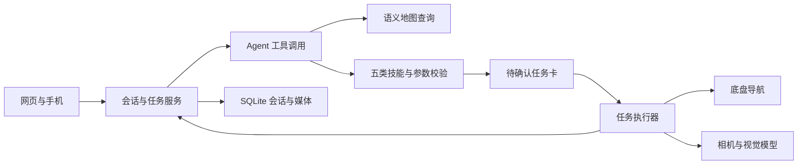

# JAKA Robot Agent

面向 JAKA 移动机器人的多模态任务助手。用户通过网页输入指令或上传参考图，Agent 查询语义地图、选择机器人技能并生成待确认计划；确认后由执行器完成导航、拍照、视觉比对和结果汇报。

适合研究和开发服务机器人应用：把“去某个地点”“找照片里的物品”“接到访客并带到指定位置”等需求，连接到可观察、可取消的实际任务。没有硬件也可以启动网页体验界面，并运行离线测试。

[演示视频](docs/demos.md) · [快速开始](#快速开始) · [系统设计](docs/architecture.md) · [实机部署](docs/deployment.md) · [测试说明](docs/testing.md)

## 演示

### 参考图寻物

上传物品照片，机器人依次检查候选地点，结合现场图进行比对，并在网页报告发现位置。

[](docs/demos.md#参考图寻物)

| 实机演示 | 网页演示 |
| --- | --- |
| [DEMO-1-1.mp4](docs/demos/DEMO-1-1.mp4) | [DEMO-1-2.mp4](docs/demos/DEMO-1-2.mp4) |

### 迎宾接待

机器人到接人点等待参考照片中的访客，再引导至送客点。当前代码在检测到候选人物后，展示现场照片，由主人在网页确认后继续。

[](docs/demos.md#迎宾接待)

| 实机演示 | 网页演示 |
| --- | --- |
| [DEMO-2-1.mp4](docs/demos/DEMO-2-1.mp4) | [DEMO-2-2.mp4](docs/demos/DEMO-2-2.mp4) |

四段视频来自早期实机录制，保留完整时长。**迎宾录像展示的是早期语音确认流程；最新版已改为主人网页照片确认，不再通过语音自动确认。** 视频用于展示任务过程，不代表最新版所有功能已完成实机验收。

## 能做什么

| 技能 | 行为 |
| --- | --- |
| 地点导航 | 查询地图目标，按顺序到达；仅在用户要求时追加返回出发点 |
| 参考图寻物 | 根据上传照片逐点搜索，报告找到的位置或未找到 |
| 迎宾接待 | 参考图外观比对 → 网页照片确认 → 引导至送客点 |
| 视觉巡逻 | 建立同点照片基线，巡逻比较变化并汇报 |
| 到点查看 | 到指定地点拍照，回答用户的问题，可按要求返回 |

- **工具调用与执行分离**：模型查询资源、选择技能；代码校验参数和地图目标，生成任务卡，用户确认后执行。
- **地图语义查询**：结合物体、房间与门口关系理解地点；地图记录与现场视觉观察分别处理。
- **任务控制**：状态、轨迹、现场照片和执行结果可在网页查看；支持取消，过期地图或不匹配的任务确认会被阻止。
- **会话与媒体**：SQLite 保存会话、任务和摘要，参考图与现场媒体按会话关联，支持历史会话恢复。
- **手机交互**：PWA 页面和手机录音转写；麦克风需要 HTTPS，语音识别依赖机器人端语音组件。

## 快速开始

下面启动的是 **Mock 界面模式**，不连接机器人、相机、麦克风或模型。它提供模拟状态和部分任务流程，Agent 对话为模拟回复，不是完整的离线大模型或机器人仿真。

本次离线验证环境为 Python 3.13；前端检查使用 Node.js。

```bash
git clone https://github.com/wang1299/JAKA-Robot-Agent.git
cd JAKA-Robot-Agent
python -m venv .venv
```

激活环境：Windows PowerShell 执行 `.venv\Scripts\Activate.ps1`；Linux/macOS 执行 `source .venv/bin/activate`。

```bash
python -m pip install -r requirements.txt
python robot_web.py --mock --host 127.0.0.1 --port 8080
```

打开 [http://127.0.0.1:8080](http://127.0.0.1:8080)。可浏览地图、技能、会话及任务界面；涉及真实照片的功能需要相机或自行提供测试图片。

要使用真实 Agent，需要配置兼容的模型服务。仓库内 `model_config.json` 保留当前开发环境的双模型配置：Qwen3.5 9B 负责 Agent 决策，MiniCPM V 4.6 负责视觉分析与部分任务规划。端口和模型名称需要匹配实际服务；参考 [部署说明](docs/deployment.md) 和 `model_config.example.json`。

## 系统结构



| 位置 | 用途 |
| --- | --- |
| `robot_web.py` / `robot_web_page.html` | Web 接口、任务状态机与交互页面 |
| `robot_agent.py` / `robot_agent_map.py` / `robot_skills.py` | Agent 循环、地图证据与技能契约 |
| `qwen_planner.py` / `robot_runtime.py` | 规划、导航驱动、取消和相机生命周期 |
| `robot_memory.py` / `robot_media.py` | 会话持久化、媒体关联与恢复 |
| `robot_client.py` / `example_capture_infer.py` / `voice.py` | 模型客户端、相机与语音 |
| `test/` / `tools/` | 离线回归、手工评估与地图维护工具 |
| `deploy/` / `docs/` | 发布清单、建图服务适配和项目说明 |

## 验证与发布

```bash
python -m pip install -r requirements-dev.txt
python tools/run_offline_checks.py --require-node
python tools/build_pi_release.py
```

离线检查包含 **332 项 Python 测试和 4 组前端检查**：当前公开环境中 329 项 Python 测试通过，3 项依赖服务器存档夹具的检查跳过，4 组前端检查通过。不调用模型、不驱动机器人；检查范围与实机边界见 [测试说明](docs/testing.md)。

发布工具依据显式清单生成 `dist/jaka-pi-runtime.tar.gz` 和 SHA256 清单，排除演示视频、测试、日志、会话数据及凭据。

## 当前边界与参与方式

实机路径依赖 JAKA 底盘、Orbbec 相机、场景地图及本地模型服务。示例地图仅用于展示；在新场地部署前需要重新确认坐标、标定和导航可达性。视觉外观相似不能证明访客身份；当前迎宾流程要求主人查看照片确认。服务尚无公网登录机制，应部署在受信任网络或受控访问入口后。

欢迎通过 Issue 提供复现步骤、日志和预期行为，或通过 PR 改进测试、硬件适配与文档。提交时请排除凭据、个人媒体和现场配置，并运行离线检查。项目级开源许可证尚待确定；第三方图标的许可说明保留在 `map_icons/FONT-AWESOME-LICENSE.txt`。
