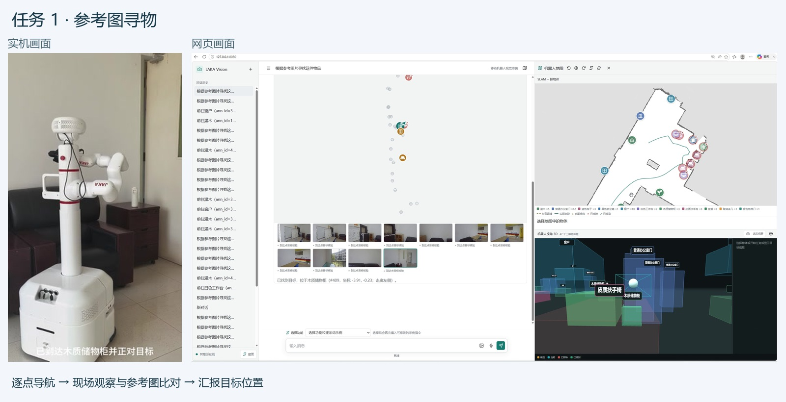
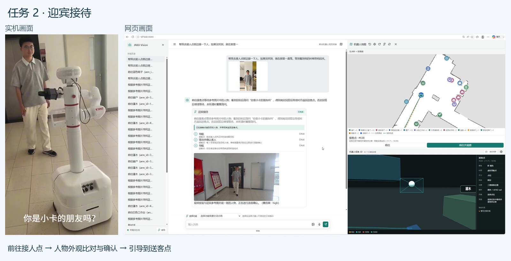
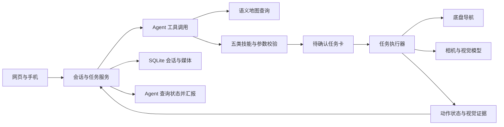

# JAKA Robot Agent

**让 Agent 理解任务，让机器人在环境中行动。** 面向 JAKA 移动机器人的多模态具身任务系统：Agent 根据语言、参考图和语义地图选择技能、生成计划；机器人导航、获取现场观察并更新任务结果，Agent 再根据执行状态汇报。

适合服务机器人应用开发、Agent 工具调用与任务执行研究。通过寻物和迎宾两类任务，展示语言目标如何落到地图点位、机器人动作与视觉证据。**没有机器人或 GPU，也能运行完整任务回放**，查看工具调用、计划确认、移动轨迹、观察结果和任务反馈。

[任务回放](docs/replay.md) · [演示视频](docs/demos.md) · [Agent 设计](docs/agent.md) · [机器人与具身任务](docs/embodied.md) · [模型部署](docs/models.md) · [实机部署](docs/deployment.md) · [参与开发](CONTRIBUTING.md)

## 两个主体如何协作

| 主体 | 输入 | 负责什么 | 可核对的输出 |
| --- | --- | --- | --- |
| Agent | 用户需求、参考图、地图与工具结果 | 查询环境证据、选择技能、补问缺失信息、生成计划、汇报执行状态 | 工具调用记录、待确认任务卡、结果回复 |
| Robot | 用户确认后的技能计划 | 导航、现场拍照、视觉比对、等待访客确认、响应停止 | 轨迹、带来源的观察、任务状态与发现位置 |

寻物中，执行器会根据观察继续搜索或结束；迎宾中，机器人会等待主人确认候选照片再引导。当前实现采用 **LLM 工具调用 + 技能执行器**，高层计划需要用户确认；不包含端到端 VLA 策略训练或模型自主循环重规划。

## 演示

### 参考图寻物

上传物品照片，机器人依次检查候选地点，结合现场图进行比对，并在网页报告发现位置。

[](docs/demos.md#参考图寻物)

| 实机演示 | 网页演示 |
| --- | --- |
| [DEMO-1-1.mp4](docs/demos/DEMO-1-1.mp4) | [DEMO-1-2.mp4](docs/demos/DEMO-1-2.mp4) |

### 迎宾接待

机器人到接人点等待参考照片中的访客，再引导至送客点。当前代码在检测到候选人物后，展示现场照片，由主人在网页确认后继续。

[](docs/demos.md#迎宾接待)

| 实机演示 | 网页演示 |
| --- | --- |
| [DEMO-2-1.mp4](docs/demos/DEMO-2-1.mp4) | [DEMO-2-2.mp4](docs/demos/DEMO-2-2.mp4) |

四段视频来自早期实机录制，保留完整时长。**迎宾录像展示的是早期语音确认流程；最新版已改为主人网页照片确认，不再通过语音自动确认。** 视频用于展示任务过程，不代表最新版所有功能已完成实机验收。

## 能做什么

| 技能 | 行为 |
| --- | --- |
| 地点导航 | 查询地图目标，按顺序到达；仅在用户要求时追加返回出发点 |
| 参考图寻物 | 根据上传照片逐点搜索，报告找到的位置或未找到 |
| 迎宾接待 | 参考图外观比对 → 网页照片确认 → 引导至送客点 |
| 视觉巡逻 | 建立同点照片基线，巡逻比较变化并汇报 |
| 到点查看 | 到指定地点拍照，回答用户的问题，可按要求返回 |

- **工具调用与执行分离**：模型查询资源、选择技能；代码校验参数和地图目标，生成任务卡，用户确认后执行。
- **地图语义查询**：结合物体、房间与门口关系理解地点；地图记录与现场视觉观察分别处理。
- **任务控制**：状态、轨迹、现场照片和执行结果可在网页查看；支持取消，过期地图或不匹配的任务确认会被阻止。
- **会话与媒体**：SQLite 保存会话、任务和摘要，参考图与现场媒体按会话关联，支持历史会话恢复。
- **手机交互**：PWA 页面和手机录音转写；麦克风需要 HTTPS，语音识别依赖机器人端语音组件。

## 快速开始

先启动 **Agent 与机器人任务回放**：不连接硬件或模型，使用预设工具决策和合成观察样例，复用实际 AgentRunner、技能校验、任务确认和取消机制。回放中的导航与视觉反馈由适配器提供，用于理解和验证任务流程。

需要 Python 3.11 或更新版本；本地离线验证使用 Python 3.13，前端检查使用 Node.js。硬件 SDK 的 Python 版本要求需另行核对。

```bash
git clone https://github.com/wang1299/JAKA-Robot-Agent.git
cd JAKA-Robot-Agent
python -m venv .venv
```

激活环境：Windows PowerShell 执行 `.venv\Scripts\Activate.ps1`；Linux/macOS 执行 `source .venv/bin/activate`。

```bash
python -m pip install -e .
jaka-agent --replay --port 8080
```

打开 [http://127.0.0.1:8080/replay](http://127.0.0.1:8080/replay)，选择“参考图寻物”或“迎宾与人工确认”，依次点击生成计划、确认执行、汇报结果。也可体验导航失败、缺少参考图和运行中停止。

也可使用 `python -m jaka_agent --replay` 或 `python robot_web.py --replay`。完整任务终端位于 `/`；原有 `--mock` 保留为界面开发模式。模式区别和接入真实决策模型的方法见[回放说明](docs/replay.md)。

要使用真实 Agent，需要配置双模型服务：Qwen3.5 9B 负责 Agent 决策，MiniCPM V 4.6 负责视觉分析与部分任务规划，当前均使用 Transformers Serve。仓库提供 GPU 环境安装、权重下载、启动、SSH 隧道和合成输入验收代码，完整步骤见[模型部署](docs/models.md)。语音模型与外部在线建图模型按需部署。端口和模型名称需要匹配实际服务；实际服务器连接信息只保存在被 Git 忽略的本地配置中。

## 系统结构



```text
JAKA-Robot-Agent/
├── src/jaka_agent/
│   ├── agent/          # 工具调用、技能契约、地图证据
│   ├── tasks/          # 任务管理、寻物、迎宾、巡逻、执行器
│   ├── hardware/       # 底盘、相机、语音、音频适配
│   ├── models/         # 模型配置、客户端、视觉分析
│   ├── replay/         # 无硬件任务回放、合成观察与决策样例
│   ├── storage/        # 会话数据库与媒体归档
│   ├── mapping/        # 建图、场景图、地图管理
│   ├── web/            # HTTP 接口、页面、独立 CSS/JS
│   ├── cli/            # 规划与设备诊断命令
│   └── resources/      # 默认配置与示例地图
├── configs/            # 现场配置模板
├── examples/           # 场景图、标定示例
├── tests/              # Python 与前端回归、手工评估
├── tools/              # 地图维护、检查和打包工具
├── deploy/             # GPU 模型部署、语音模型下载、设备运行清单与建图适配
├── docs/               # 部署、设计、测试与四段演示
├── pyproject.toml      # 安装、依赖与命令入口
└── robot_web.py         # 原启动命令的兼容入口
```

源码与运行数据分开：新安装默认把数据库、照片、录像、日志和新地图写入当前工作目录的 `data/`，也可设置 `JAKA_DATA_DIR`。已有根目录会话和媒体在未指定新数据目录时继续复用，迁移细节见[部署说明](docs/deployment.md#运行数据与发布)。

## 验证与发布

```bash
python -m pip install -e ".[dev]"
python tools/run_offline_checks.py --require-node
python tools/evaluate_agent.py --mode replay
python tools/build_pi_release.py
```

测试覆盖工具协议、地图依据、确认与取消、寻物观察反馈、迎宾照片确认及安装后的网页资源。另提供 **5 个固定任务契约评估案例**，输出逐项检查与耗时报告；预设回放成绩不代表模型准确率或实机成功率。验证记录与边界见[测试说明](docs/testing.md)。

发布工具依据显式清单生成 `dist/jaka-pi-runtime.tar.gz` 和 SHA256 清单，排除演示视频、测试、日志、会话数据及凭据。

## 当前边界与参与方式

实机路径依赖 JAKA 底盘、Orbbec 相机、场景地图及本地模型服务。示例地图仅用于展示；在新场地部署前需要重新确认坐标、标定和导航可达性。视觉外观相似不能证明访客身份；当前迎宾流程要求主人查看照片确认。服务尚无公网登录机制，应部署在受信任网络或受控访问入口后。

欢迎通过 Issue 提供复现步骤、日志和预期行为，或通过 PR 改进技能、硬件适配、评估与文档，具体入口见[开发指南](CONTRIBUTING.md)。项目级开源许可证尚待确定；第三方图标的许可说明保留在 `src/jaka_agent/web/static/map_icons/FONT-AWESOME-LICENSE.txt`。
