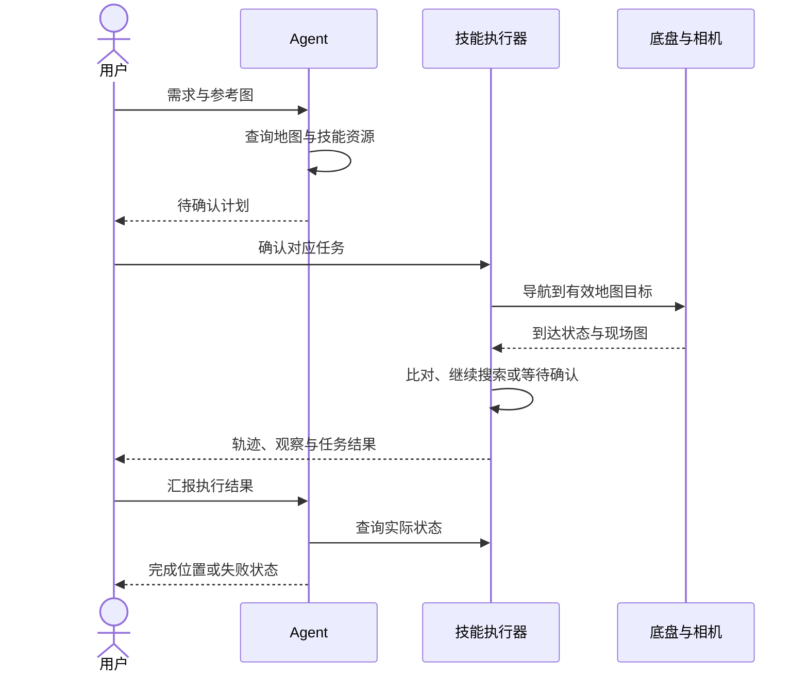

# Robot：动作、观察与任务反馈

项目的具身部分是移动机器人任务执行：把语言目标绑定到环境中的地点与对象，在移动后获取现场观察，再据此推进任务。当前重点是导航、寻物、迎宾和视觉巡逻；不包含机械臂抓取、VLA 模型训练或强化学习训练。

## 两个代表任务

**参考图寻物。** 执行器选择有导航坐标的候选点，移动并获取观察，调用视觉服务比对参考图。未匹配则继续，匹配后记录位置并结束；没有可靠观察时保留“无法确认”。对应实现为 `tasks/find_object.py`。

**迎宾接待。** 到接人点观察候选访客，视觉服务进行外观比对。主人必须查看网页上的现场照片并确认，执行器才会继续引导；拒绝后继续等待。确认标识绑定会话、任务和当前照片，旧确认不能放行新照片。对应实现为 `tasks/welcome.py`。外观比对不提供身份认证。

## 设备与控制边界

| 层 | 代码入口 | 职责 |
| --- | --- | --- |
| 任务管理 | `tasks/manager.py`、`cards.py` | 计划、确认、状态、地图版本与取消 |
| 技能执行 | `tasks/executor.py`、`find_object.py`、`welcome.py`、`patrol.py` | 任务步骤与观察反馈 |
| 导航设备 | `hardware/navigation.py` 中的 `NavDriver`、`JakaTCPDriver` | 移动、停止、位姿、导航终态 |
| 相机与到点观察 | `hardware/camera.py`、`observation.py` | 获取图像、调整观察与管理设备资源 |
| 感知模型 | `models/vision.py`、`perception.py`、`person_match.py` | 图像描述、目标比对与外观比对 |
| 语义环境 | `mapping/` | 场景图、坐标、地图更新与标定 |

执行前检查计划状态、所有者、地图版本和机器人状态。停止请求传递到导航、观察和模型请求；重启后恢复历史不会重新授权旧动作。以上软件检查不能替代实际底盘的避障、急停与现场验收。

## 无硬件与实机之间

回放复用任务契约和控制机制，但导航通过插值更新演示位姿，图片通过几何图形生成，视觉结果使用预设标注。它验证动作与观察如何影响流程，不模拟碰撞、动力学、相机误差或识别准确率。

实机演示仍使用原有四段录像，见[视频说明](demos.md)。新版照片确认等功能还需要现场复验。部署要求见[硬件准备](hardware.md)和[实机部署](deployment.md)；更换底盘、相机或新增技能的入口见[开发指南](../CONTRIBUTING.md)。
